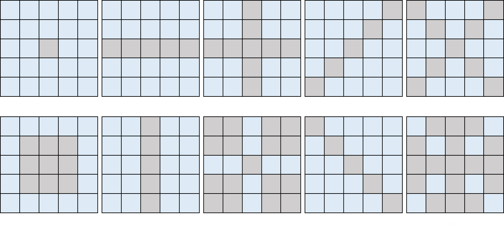

# MM-BSN: Self-Supervised Image Denoising for Real-World with Mutil-Mask based on Blind-Spot Network
MM-BSN has been accepted by CVPR2023 UG2+ workshop and it will be published with the CVPR Workshop Proceedings. 
---

## Setup

### Requirements

Our experiments are done with:

- Python 3.8.0
- PyTorch 1.12.0
- numpy 1.22.3
- opencv 4.6.0.66
- scikit-image 0.19.3

### Directory

Follow below descriptions to build code directory.

```
AP-BSN
├─ ckpt
├─ config
├─ DataDeal
├─ dataset
│  ├─ DND
│  ├─ SIDD
│  ├─ prep
│  ├─ test_data
├─ figs  
├─ model
├─ output
├─ util
```

- Make `dataset` folder which contains various dataset.
  - place [DND](https://noise.visinf.tu-darmstadt.de/), [SIDD](https://www.eecs.yorku.ca/~kamel/sidd/) datasets at here.
  - `prep` folder contains prepared data for efficient training. (cropped patches with overlapping by `Data_prep.py`)
  - `test_data` folder contains some images with noise.
- Make `output` folder which contains experimental results including checkpoint, val/test images and training logs.
- Recommend to use __soft link__ due to folders would take large storage capacity.


## Quick test

To test noisy images with pre-trained MM-BSN in gpu:0.

```
python test.py -c SIDD -g 0 --pretrained ./ckpt/SIDD_MMBSN_020.pth --test_dir ./dataset/test_data
```

---

## Training

```
usage: python train.py [-c CONFIG_NAME] [-g GPU_NUM] 
                       [-r RESUME] [-p PRETRAINED_CKPT] 
                       [-t THREAD_NUM] [-se SELF_ENSEMBLE]
                       [-sd OUTPUT_SAVE_DIR] [-rd DATA_ROOT_DIR]

Train model.

part of Arguments in config SIDD.yaml:  
   model:
  kwargs:
    type: MMBSN    # basic model types, eg.MMBSN, CSCBSN
    pd_a: 5
    pd_b: 2
    pd_pad: 2
    R3: True
    R3_T: 8
    R3_p: 0.16
    in_ch: 3
    bsn_base_ch: 128
    bsn_num_module: 9
    DCL1_num: 2
    DCL2_num: 7
    mask_type: 'o_fsz'  # mask types, eg. 'o_a45' means the combination of 'o' and 'a45'
    
```

Also, you can control other detail experimental configurations (e.g. training loss, epoch, batch_size, etc.) in each of config file.

### Mask types:



## Acknowledgement
 Part of our codes are adapted from [AP-BSN](https://github.com/wooseoklee4/AP-BSN) and we are expressing gratitude for their work sharing.
